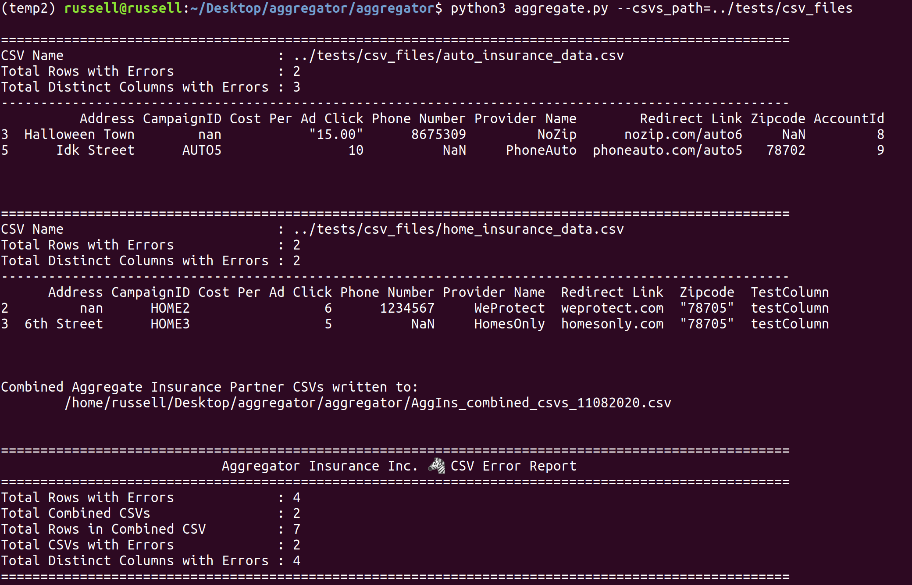

# Aggregator Overview
Aggregator is a python package meant to simplify combining, cleaning, and validating CSV files received from partners for Insurance Aggregator Inc.

Aggregator is written by Russell Peck, a software engineer in Austin, Texas with an interest in striped African wildlife. He can be reached at peck.russell@gmail.com

# Aggregator Design
Aggregator has been designed in an object-oriented fashion that currently supports 4 classes.
- **Validation**

    This class contains all the individual methods needed to validate any insurance CSV files. Validation methods are decorated with a method (**_error_count**) to allow tracking of errors across validation methods, and across the entire CSV file being validated. Using this decorator method allows individual validation methods to be written to work on a single input value instead of also having to update instance variables. This prevents duplication of code, and eases tracking errors discovered in CSV files.

    Standard validation methods are applied to all values that are validated, and are held in an class attribute called **std_validations**. Validation methods specific to a certain type of value are also defined, but have to be identified in a defined Schema class's list attribute **validations** to be applied to values.
- **GeneralSchema**

    This class acts as schema for the CSV files being processed by defining expected fields from respective insurance partner CSVs. It specifies a CSV file's expected type, nullability, name, and specific Validation methods for each field to be to be run. Validation methods to be run on a field are held in a list to allow for the easy addition of methods to apply to a field. Further Schema classes can be written by inheriting the Validation class.

    Using this class allows the programmer to get, use, and track validation methods as they are applied to CSV files.
- **AggCSV**

    An AggCSV instance is created for each CSV to be parsed, cleaned, and validated before being combined into a larger CSV file. The CSV file is read in as a pandas dataframe, and creates a GeneralSchema instance to use to determine what type of validation needs to be run on each Series of the pandas DataFrame. Errors from validating data are moved here from the GeneralSchema class.

    Tracked errors from the CSV file are collected and used to print out rows and a short summary of the DataFrame's issues. These rows are removed from the validated DataFrame afterwards.
- **Combine**

    All CSV files of an insurance type are read in from a single specified path on the machine and collected into a dataframe with this class before being written out to the current working directory as a single CSV. All files in the specified path must be CSV files. A final summary of collected errors across CSV files can be printed.

# Programmer Thoughts 

The **Aggregator** package was designed with the idea of continued use, and the possibility to easily expand it in the future. This thinking is highlighted through the following choices:
- Utilizing existing packages

    * For small scale data manipulation such as this **pandas** is the obvious choice. Using this highly supported and extremely well documented package is much easier than creating an external package for standard data manipulation. Testing also determined that the **pandas** package easily handles multiple different line terminators on csv files.

- Object-Oriented Approach
    * This exercise called for a single schema, but based on the input data coming from two different types of insurance its clear there could be room in the future to define and use multiple schemas. Creating a super class to build a schema object on top of can aid in quickly building out new tables or schemas.

- Utilize Packaging Tools
    * By taking advantage of **setup.py** and virtual environments providing this package for use to company programmers is made easy. This takes care of dependency issues, and sets this package up for easy automated installation on cloud machines in the future via download from private github repository, or from a secure company AWS S3 location with **pip**.

# External Dependencies

**Aggregator** relies on **pandas** for data manipulation and applying methods to validate data. **Validators** is used to check domain names. **pytest** is used for unit testing. Packages are installed when installation of **setup.py** occurs.

# Operating System
This package was developed on a machine running Linux Ubuntu 18 and should work on Mac OS as well. Windows OS has not been tested.

# Package Installation
It is a good idea to create a python virtual environment before installing the **aggregator** package. This can be done by issuing the following commands: 
~~~
python3 -m venv environment
source environment/bin/activate
~~~

Navigate to the **aggregator** directory of the package with with the setup.py file and run the following command to install globally:
~~~
sudo python3 setup.py install
~~~

# Using Aggregator
Individual classes can be imported from the aggregator package for use in other code files, however the aggregate.py file has been designed to be used as a bash utility for ease of integration in scheduled pipeline tools like Jenkins by utilizing the native python **argparse** library. To run **aggregator** on the included sample CSV files navigate to the **aggregator** directory and run the following command:
~~~
python3 aggregate.py --csvs_path=../tests/csv_files
~~~
Help for this command line utility can be seen with:
~~~
python3 aggregate.py -h
~~~

# Running Tests
The module **pytest** was chosen to write tests for this package because of the increased flexibility and control it provides over the native **unittest**. After navigating to the directory containing the tests folder, tests for this package can be run and seen with the following command:
~~~
python3 -m pytest tests -v
~~~
Tests have been written for all critical pieces of the codebase, but like always there is no substitute for running code on production datasets at scale. Additional test data was created and is stored in **conftest.py** under the **tests** directory to aid in testing this package, along with other helper test functions.

# Future Considerations and Development
The following points should be considered for future development:
- Scalability
    * **Aggregator** utilizes **pandas** for data manipulation, but this comes with limitations. **Pandas** is a single-threaded utility, and therefore doesn't scale well with truly large data. For the current application of running this program once a day on a dataset of limited size there is no issue. Tests in the **test_combine.py** file were written (now commented out) to test package performance on ingesting thousands of files, and the program completed in a few minutes. To initially scale this application the **swifter.apply** package and method can be utilized with very minimal code changes, however at much larger scale switching to a more **Apache Spark** based approach should be considered.

- Address Validation
    * Very little validation was done on address related fields (address, zipcode) other than checking types, null values, and standardizing presentation. Utilizing a geocoding package in the future to run on an interval could help ensure address provided are legitimate.
- Name Standardization
    * No specific standardization was done to fields like **Provider Name**, and **CampaignID**  in this program, but it would likely be a good idea to standardize how these are ingested internally so they can easily be linked to other data.
